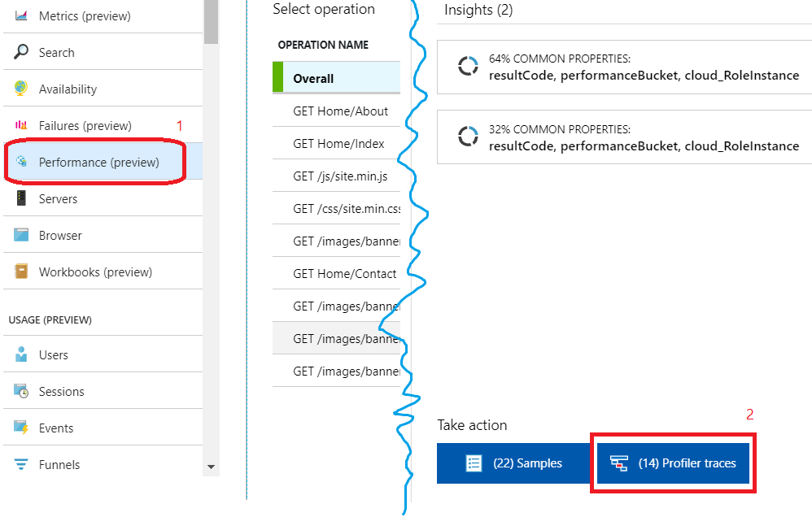

# Enable Service Profiler for containerized ASP.NET Core application

Enable Service Profiler for ASP.NET Core application running in Linux Container is very easy and almost code free.

This example assumes you already have an ASP.NET Core Application. If you are new to ASP.NET, follow the Get Started for [.NET Core Application](https://dotnet.microsoft.com/) or just clone and use this project.

This example is a bare bone project created by calling the following cli command:

```shell
dotnet new mvc -n EnableServiceProfilerForContainerApp
```

To make it real, make use the following code to add some delay in the controllers to simulate the bottleneck:

```CSharp
private void SimulateDelay()
{
    // Delay for 500ms to 2s to simulate a bottleneck.
    Thread.Sleep((new Random()).Next(500, 2000));
}
```

Reference [HomeController.cs](./Controllers/HomeController.cs) for full code.

## Pull the latest ASP.NET Core build/runtime images

```shell
docker pull mcr.microsoft.com/dotnet/sdk:3.1
docker pull mcr.microsoft.com/dotnet/aspnet:3.1
```

_Tips: find the official images for [sdk](https://hub.docker.com/_/microsoft-dotnet-sdk) and [runtime](https://hub.docker.com/_/microsoft-dotnet-aspnet)._

## Create a Dockerfile for the application

To enable Service Profiler, NuGet package needs to be installed and proper environment variables need to be set. One way to reach the goal is adding the following lines to your [Dockerfile](./Dockerfile). In this file:

* It adds the reference to the NuGet package of Service Profiler before the build of the project happens.
* It sets the instrumentation key to Application Insights so that the application knows where to send the trace to.
* It uses the hosting startup assembly for the entry point of Service Profiler.

*To make your build context as small as possible add a [.dockerignore](./.dockerignore) file to your project folder.*

## Create an Application Insights resource

Follow the [Create an Application Insights resource](https://docs.microsoft.com/en-us/azure/application-insights/app-insights-create-new-resource). Note down the [instrumentation key](https://docs.microsoft.com/en-us/azure/application-insights/app-insights-create-new-resource#copy-the-instrumentation-key).

## Optionally set the log level to Information for Service Profiler

To see a simple log, you can add the following settings to appsettings.json to reveal some Service Profiler logs:

```json
    "LogLevel": {
      "Default": "Warning",
      "ServiceProfiler":"Information"
    }
```

Just like in [appsettings.json](./appsettings.json).

## Build and run the Docker image

```shell
docker build -t enable-sp-example --build-arg APPINSIGHTS_KEY=YOUR_APPLICATION_INSIGHTS_KEY .
docker run -p 8080:80 --name enable-sp enable-sp-example
```

Note, replace **YOUR_APPLICATION_INSIGHTS_KEY** with the real instrumentation key from the previous step.

Once the container starts to run, the Service Profiler will kick in for 2 minutes.

## View the web page running from a container

Go to [localhost:8080](http://localhost:8080) to access your app in a web browser. Use this chance to generate some web traffic for the Service Profiler to catch the traces.

## Inspect the logs

If you have set up the Log Level to Information for Service Profiler and you run the container attached, you will see the info logs like it below:

```shell
info: ServiceProfiler.EventPipe.Client.Schedules.TraceSchedule[0]
      Service Profiler session started.
info: ServiceProfiler.EventPipe.Client.Schedules.TraceSchedule[0]
      Service Profiler session finished. Samples: 8
info: ServiceProfiler.EventPipe.Client.TraceUploader.TraceUploaderProxy[0]
      Finished calling trace uploader. Exit code: 0
```

When you see Samples number larger than 0, it means trace has been gathered.

You can also check the logs for the container:

```shell
docker container logs myapp
```

## View the Service Profiler traces

* Wait for 2-5 minutes so the events can be aggregated to Application Insights.
* Open the **Performance** blade in the application insights resource created. Once the process of the trace is done, you will see the Profiler Traces button like it below:



## Summary

To recap a bit, there are 2 major steps to enable Service Profiler:

* Add the reference to the NuGet package.
* Set the environment variables to enable it.

There are various ways to reach the same goal. The NuGet package could be installed in the project. The environment variable could be set by the orchestrator (like Kubernetes) as well.

And when it comes to production deployment, there are also other aspects to be considered, like the security. For example, how to protect Application Insights Instrumentation key from being leaked and so on.

All in all, we hope the Service Profiler will help improve the application performance! If you have any issues or suggestions, please report to [issues](https://github.com/Microsoft/ApplicationInsights-Profiler-AspNetCore/issues).
