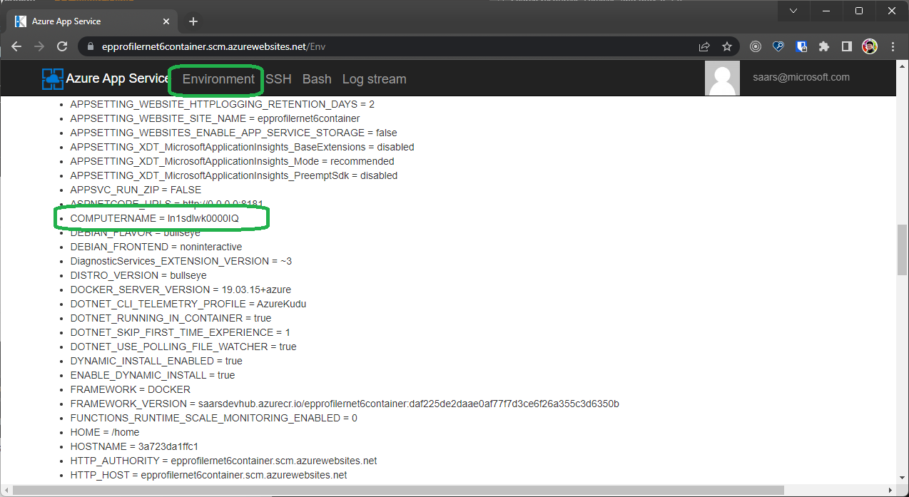

# Enable Service Profiler for containerized ASP.NET Core Application (.NET 6)

## Overview

To enable the Application Insights Profiler on your container, you will need to:

* Add the reference to the NuGet package.
* Register services to enable profiler.

In this article, you'll learn the various ways you can:
- Install the NuGet package in the project. 
- Register the service to enable profiler.

  Notice: this post is NOT about security best practice. you will need to take your security measure according to your orchestrator/environment. For example, use secrets in Kubernetes for sensitive configurations.

## Pre-requisites

- [An Application Insights resource](https://docs.microsoft.com/en-us/azure/azure-monitor/app/create-new-resource). Make note of the instrumentation key.
- [.NET 6 SDK](https://dot.net) for creating projects and local build.
- [Docker Desktop](https://www.docker.com/products/docker-desktop/) to build docker images.

### Make an example project

Either use a provided project or build your own. Here's how:

**Use an existing project**

1. Fork / clone and use the following sample project:

    ```bash
    git clone https://github.com/microsoft/ApplicationInsights-Profiler-AspNetCore.git
    ```

2. You will find the example project under `examples\EnableServiceProfilerForContainerAppNet6`.

**Build your own**

If you want to build your own project, here are the steps:

1. Start a bare bone webapi project created by templates:

    ```bash
    dotnet new webapi
    ```

1. Add reference to NuGet packages:

    ```bash
    dotnet add package Microsoft.ApplicationInsights.Profiler.AspNetCore
    ```

    _Tips_: Find out the latest NuGet package by visiting [nuget.org](https://www.nuget.org/packages/Microsoft.ApplicationInsights.Profiler.AspNetCore/).

1. Enable Profiler by registering it into the Service Collection in [Program.cs](./Program.cs):

    ```csharp
    builder.Services.AddApplicationInsightsTelemetry(); // Register Application Insights
    builder.Services.AddServiceProfiler();              // Register Profiler
    ```

1. Add application insights configurations ([appsettings.json](./appsettings.json)) as a sibling to `Logging` to connect to the Application Insights resource created:

    ```json
    {
        "ApplicationInsights":
        {
            "InstrumentationKey": "Your instrumentation key"
        }
    }
    ```


1. Add a delay in [WeatherForecastController](./Controllers/WeatherForecastController.cs) to simulate a bottleneck. And call it whenever WeatherForecast endpoint is hit.

    ```csharp
    [HttpGet(Name = "GetWeatherForecast")]
    public IEnumerable<WeatherForecast> Get()
    {
        SimulateDelay();
        ...
        // Other existing code.
    }
    private void SimulateDelay()
    {
        // Delay for 500ms to 2s to simulate a bottleneck.
        Thread.Sleep((new Random()).Next(500, 2000));
    }
    ```

1. Build the project to make sure it works.

    ```shell
    dotnet build
    ```

Move on to dockerize the application once build succeeded.

### Dockerize the application above

1. Review the [dockerfile](./dockerfile).
1. Build the image with it:

    ```shell
    docker build -t profilerapp .
    ```
1. Run the container

    ```shell
    docker run -d -p 8080:80 --name testapp profilerapp
    ```

    Note: The Profiler will run for 2 minutes. That is the best chance for testing and it is important to hit the endpoint to generate some traffic for profiling during this period. If you missed the window, kill the container and run it again.

1. To hit the endpoint, visit <http://localhost:8080/weatherforecast> in your browser or use curl:

    ```shell
    curl http://localhost:8080/weatherforecast
    ```

1. Optionally, inspect the local log to see if a session of profiling finished by:

    ```shell
    docker logs testapp
    ```

    There are some key events to pay attention to like:

    ```shell
    Starting application insights profiler with instrumentation key: your-instrumentation key # Double check the instrumentation key
    Service Profiler session started.               # Profiler started.
    Finished calling trace uploader. Exit code: 0   # Uploader is called with exit code 0.
    Service Profiler session finished.              # A profiling session is completed.
    ```

    Notes: If there is no uploader related events, chances are, there's no traffic during the session. Kill the container and run it again.

1. Wait for 2 to 5 minutes for the Profiler show up in your Application Insights resource in the Portal.

1. Clean up the local container

    ```shell
    docker rm -f testapp
    ```

## Customizing the Cloud_RoleInstance for Containers in Azure App Service

To better correlate the container with the host of your application when deploying directly to Azure App Service, a telemetry initializer can be introduced. This will help address the issue where the value for cloud_RoleInstance is simply the container id, which may not be easily identifiable with the host. Follow these steps:

1. Create the telemetry initializer, see [RoleInstanceTelemetryInitializer](./RoleInstanceTelemetryInitializer.cs) for an example:

    ```csharp
    public class RoleInstanceTelemetryInitializer : ITelemetryInitializer
    {
        public void Initialize(ITelemetry telemetry)
        {
            string? computerName = Environment.GetEnvironmentVariable("COMPUTERNAME");
            if (string.IsNullOrEmpty(computerName))
            {
                return;
            }
            telemetry.Context.Cloud.RoleInstance = computerName;
        }
    }
    ```

    Tips: 

    * "COMPUTERNAME" was used as an example, you could pick any useful environment variables from Kudu:
        

    * With telemetry initializer, any property on the telemetry could be customized. See [here](https://learn.microsoft.com/en-us/azure/azure-monitor/app/api-filtering-sampling#addmodify-properties-itelemetryinitializer) for more details.
    * Do not use async code or heavy logic in telemetry initializers.

1. Register it at the startup of your application, see [Program.cs](./Program.cs) for an example:

    ```csharp
    // Register RoleInstanceTelemetryInitializer as an ITelemetryInitializer
    builder.Services.AddSingleton<ITelemetryInitializer, RoleInstanceTelemetryInitializer>();
    ```

And here's how it looks like:


## Related topics

* [Add customize configurations](../../Configurations.md) - There are lot of customization supported like profiling duration, local cache folder, upload mode, etc.
* [Sets logging level for Profiler](../../Configurations.md#sets-the-logging-level-for-profiler) - logging is useful and important for troubleshooting.

## Reference

* [Dockerize an ASP.NET Core application](https://docs.docker.com/samples/dotnetcore/)
